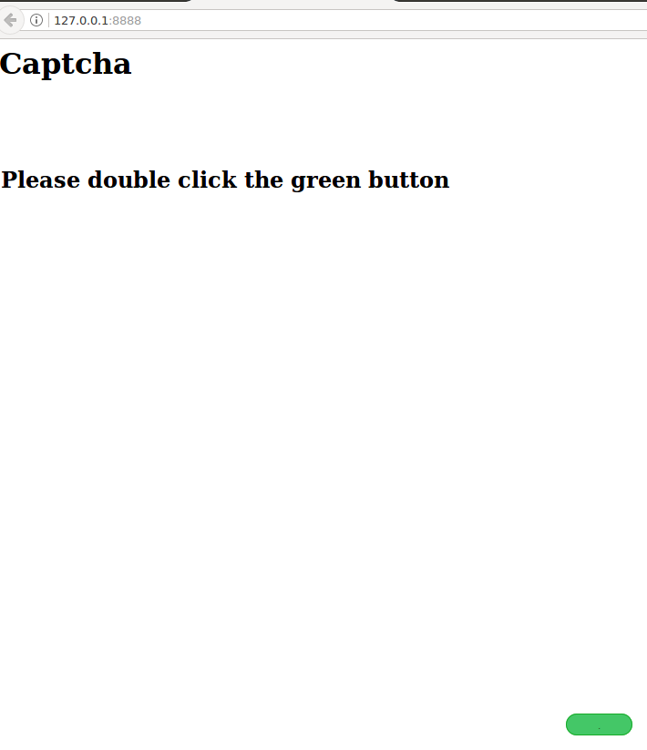
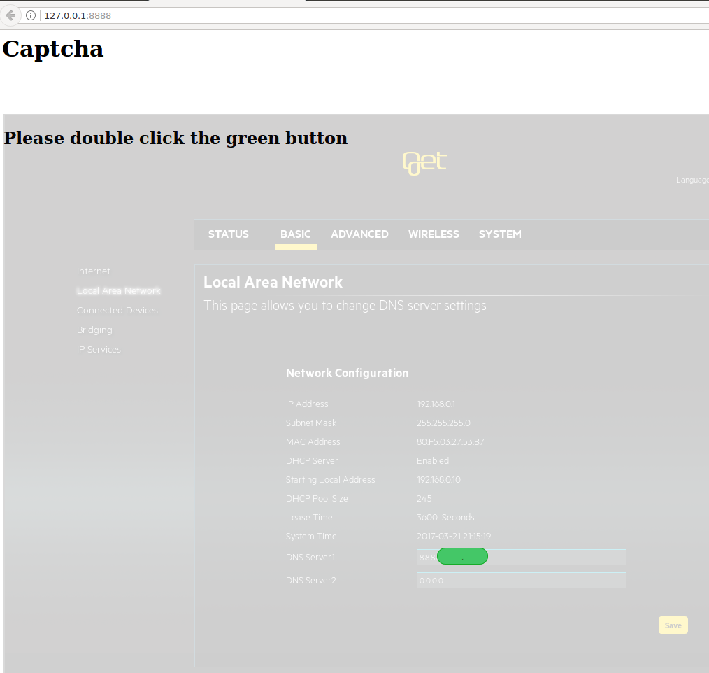

# Security Advisory - Get box 2
The vulnerabilities were tested on Get Box 2. Using a combination of the
vulnerabilities found it is possible to change the router settings and read
WiFi-passwords by tricking the user into visiting an arbitrary web site that
the attacker controls. One proof-of-concept (PoC) was created to modify the
settings for DNS-server to launch a man-in-the-middle (MITM) attack against all
users on the network.

# Vulnerability description
## Default Username and Password

By default, the username is "home" and the password is "home". This can be
changed, but this is not recommended in the installation instructions and it is
therefore likely that a default username and password is common. Default
username and password makes it easier to exploit the following vulnerabilities,
but is not a necessity.

## Cross-Site-Request-Forgery (CSRF)

When sending in data via HTML-form, there are no random or unpredictable
elements. It is therefore possible to construct a valid form from a different
site. If the user visits a web page controlled by the attacker while being
authenticated against the admin interface on the router, the attacker can send
forged requests to the admin interface. If the default password has not been
changed, the attacker does not need the user to be authenticated.

### PoC

The HTML-code below is the attack code hosted by the attacker. If a user visits
the page, the following will happen:

1. The browser will use basic authentication to authenticate to the site
192.168.0.1 using the username and password combination home:home.
2. The browser will submit the form that will change the primary and secondary
DNS server to 192.168.0.17.
3. The router will automatically be rebooted so changes take effect.

[CSRF exploit code - change DNS server settings](exploits/csrf/exploit.html)

The HTML-code above will generate the POST-request below (unecessary information
removed). Based on the 'referer'-header it can be seen that the request
originated from an extrernal web site.

~~~
POST /goform/BasicLAN HTTP/1.1
Host: 192.168.0.1
Referer: http://ec2-54-194-119-66.eu-west-1.compute.amazonaws.com/exploit.html
Authorization: Basic aG9tZTpob21l
Connection: close
Content-Type: application/x-www-form-urlencoded
Content-Length: 123

SelectLanguage=en_US&LogoutApplyAction=&BasicLANDNSServer1=192.168.0.17&
BasicLANDNSServer2=192.168.0.17&BasicLANDomainName=
~~~

To verify a working exploit, Dnsmasq was used to hijack traffic to the domain
"www.get.no". The server at 192.168.0.17 had the following files:

~~~
$ cat /etc/dnsmasq.conf 
no-dhcp-interface=
server=8.8.8.8

no-hosts
addn-hosts=/etc/dnsmasq.hosts
~~~

~~~
$ cat /etc/dnsmasq.hosts 
192.168.0.17 www.get.no
~~~

After restarting networking on the victim computer, the change in DNS-servers
took effect. Below it can be seen that requesting IP address for "www.get.no"
returns the IP address 192.168.0.17.

~~~
$ dig www.get.no

; <<>> DiG 9.10.3-P4-Ubuntu <<>> www.get.no
;; global options: +cmd
;; Got answer:
;; ->>HEADER<<- opcode: QUERY, status: NOERROR, id: 28151
;; flags: qr aa rd ra ad; QUERY: 1, ANSWER: 1, AUTHORITY: 0, ADDITIONAL: 0

;; QUESTION SECTION:
;www.get.no.			IN	A

;; ANSWER SECTION:
www.get.no.		0	IN	A	192.168.0.17

;; Query time: 5 msec
;; SERVER: 127.0.1.1#53(127.0.1.1)
;; MSG SIZE  rcvd: 44
~~~

## Cross-Site-Scripting (XSS)
Some input fields were found to be vulnerable to XSS. The input fields could
only be set with an authenticated session and therefore could only be exploited
through the CSRF-vulnerability.

### PoC

Visiting a web site with the contents below will infect the router's traceroute
page with XSS that will display an alert-box. The user will be redirected to the
page immediately to complete the exploit.

[XSS exploit code](exploits/xss/exploit.html)

## UI Redressing (Clickjacking)

It is possible to include several of the web pages on the router as invisible
iframes on a separate external web application. The web application on the attacker's
domain can overlay the invisible iframe with other data that could be used to
entice clicks. On some browsers it is also possible to drag text into input
fields on the included iframe (Firefox was verified to work and Chrome was
verified to not work).

The techniques above combined could be used to trick a user into clicking on
hidden elements and drag hidden text (disguised as boxes) into hidden input
fields. Because of the
default username and password, this can be accomplished without the user being
authenticated on the admin interface.

### PoC

The HTML-code below is the attack code hosted on the attacker's web site. For a
successfull attack, the victim must perform the following:

1. Visit the web page
2. Click on three different buttons
3. Press delete
4. Drag a box into another box
5. Press two more buttons

[Clickjacking exploit code - change DNS server settings](exploits/clickjacking/exploit.html)

To create a semi-realistic scenario, the web page was designed to look like a
CAPTCHA. In a CAPTCHA it would be natural to ask the user to click and drag
certain objects and it is therefore appropriate as an attack vector.

The image below show the first page of the attackers page. The web interface on
the router is hidden behind an invisible iframe.

The same page, but with opacity set to 0.2 is shown the below. The green button
is placed above the input field that the victim must click.

## Browser cache poisoning
The CSRF, XSS and clickjacking vulnerabilities has been patched, but the use of
default passwords has not been changed. 
Because of the default username and password, any code running on the internal
network can modify settings on the router. One way to achieve this is to
compromise one computer on the network, a different approach is to extend a
MiTM-attack by poisoning the browser's cache.

If an attacker is able to perform a MiTM-attack on a user, the attacker can
impersonate the router on that network. In addition, to impersonating the
router, the attacker can inject iframes to the fake router for any browser
connection over HTTP. This combined with a long caching policy on the web sites
visited means that the attacker can inject a fake web page in the user's cache
that is triggered when the user visits the same web page from their home
network.

An outline of the attack is shown below:
1. Perform a MiTM-attack on the user (for example wireless hotspot,
ARP-poisoning, etc.)
2. Create the fake web app that performs some action on the router (like
changing the DNS-settings). Changing the DNS-settings be achieved by reading the
real web page of the router and extracting the CSRF-token. The fake web app
should only submit this request when the user is on their home network.
3. Create a web server on the IP 192.168.0.1. This IP-address is hard-coded in
the documentation of the router, so it is unlikely to change. The code in step 2
should be served here.
4. Intercept all HTTP-traffic and do the following:
	1. Change HTTP-caching to store all responses for a long time.
	2. Inject an iframe to 192.168.0.1 on all web sites
5. If the user is on their home network and visits any of the HTTP web sites
they visited during the MiTM-attack, the exploit code will be triggered.

A complete exploit was done with [bcp](https://github.com/rstenvi/bcp). The
necessary files are linked below:

[bcp config file](exploits/cache-poisoning/bcp.json)

[Fake router app](exploits/cache-poisoning/web/index.html)

[functions.js](https://raw.githubusercontent.com/rstenvi/Burger/57291c765ef83eb06df65c29b34a8fbbccfa89cf/helpers/functions.js)

